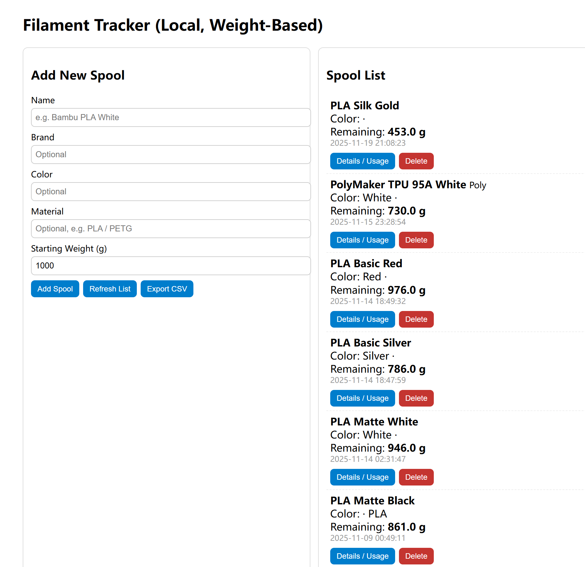

# 3D_Printing
Collections of tools to manage my 3D printing tasks


## Filament Tracker (Local)

A lightweight **local-only filament inventory and usage tracker** for 3D printing.

This project was **built with the assistance of AI** (design discussion, refactoring, and documentation), but the goal and direction are human-driven: a small, understandable, local tool that does one thing well.

Built with **Flask + SQLite + vanilla HTML/JavaScript**, focused on simplicity, transparency, and easy modification.

---

### What This App Does

Filament Tracker keeps track of filament **by weight (grams)** only.

It intentionally avoids:
- slicer integrations
- cloud sync
- accounts or authentication
- material assumptions (density, diameter, etc.)

You log what you use, and it tells you what remains.



---

### Features

- **Spool management**
  - Add, edit, and delete filament spools
  - Track brand, color, material, starting weight
- **Usage tracking**
  - Log filament usage in grams
  - Edit or delete individual usage records
  - Remaining weight recalculates automatically
- **Export**
  - Export all spools and remaining weight as CSV
- **Local-first**
  - Runs entirely on your machine
  - Uses SQLite (`filaments.db`)
  - No external services
- **Clean internal structure**
  - Routes, services, and database access are separated
  - Easy to extend or refactor

---

### Project Structure

```
filament_tracking/
├─ app.py                      # Entry point
├─ filaments.db                # SQLite database (auto-created)
└─ filament_tracker/
   ├─ __init__.py               # Flask app factory
   ├─ config.py                 # Config (DB path, timezone)
   ├─ db.py                     # DB connection & schema
   ├─ services/
   │  ├─ __init__.py
   │  └─ inventory.py           # Business logic (remaining grams)
   ├─ routes/
   │  ├─ __init__.py            # Blueprint registration
   │  ├─ pages.py               # /
   │  ├─ spools.py              # /api/spools
   │  ├─ usages.py              # /api/usages, /api/usage/<id>
   │  └─ export.py              # /api/export/csv
   └─ templates/
      └─ index.html             # Frontend UI
```

### Requirements

This project is intentionally minimal.

#### System Requirements
- Operating System: Windows, macOS, or Linux
- Python **3.9 or newer**  
  (required for the built-in `zoneinfo` module)

#### Python Dependencies
- Flask

No database server is required.  
The application uses **SQLite**, which is included with Python.

#### Recommended Environment
- **conda** (Anaconda or Miniconda)

While not required, using a dedicated conda environment is strongly recommended to keep dependencies isolated.

---

### Setup and Startup

#### 1. Create and Activate a Conda Environment

```bash
conda create -n filament-trk python=3.11
conda activate filament-trk
pip install flask // One-time
python app.py

```

The server runs at: http://127.0.0.1:5000

Browser will open automatically

The SQLite database file (filaments.db) is created automatically if it does not exist